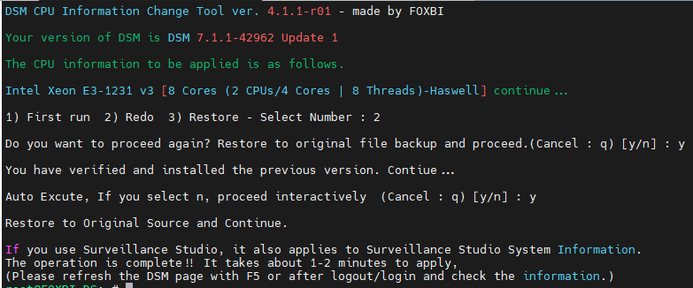

# Howto Run

1. Download attached file on your PC (ch_cpuinfo.tar)

2. Upload file to your DSM location (by filestation, sftp, webdav etc....)

3. Connect to ssh by admin account. (dsm > control panel > terminal & snmp > terminal > enable ssh check)

4. Switch user to root:

   > sudo su -
   
   (input admin password)

5. Change directory to where `ch_cpuinfo.tar` file is located:

   > cd /volume1/temp

6. Decompress file & check file:

   > tar xvf ch_cpuinfo.tar 
   > ls -lrt
   > chmod 755 ch_cpuinfo

   (check root’s run auth)

7. Run to Binary file

   > ./ch_cpuinfo 
   or 
   > ./ch_cpuinfo.sh (If you use busybox in 5.x, you can use it as a source file)
 
8. When you execute it, proceed according to the description that is output.

9. Check your DSM’s CPU name, CPU cores at `information center`

# Reference URL

https://xpenology.com/forum/topic/13030-dsm-5x6x-cpu-name-cores-infomation-change-tool

# Reference Screeshot

